

  <picture><source media="(prefers-color-scheme: dark) and (max-width: 600px)" srcset="assets/profile-header-v7-mobile-dark.svg"><source media="(prefers-color-scheme: dark)" srcset="assets/profile-header-v7-dark.svg"><source media="(max-width: 600px)" srcset="assets/profile-header-v7-mobile-light.svg"><source media="(prefers-color-scheme: light)" srcset="assets/profile-header-v7-light.svg"></picture>

  <b>A curious developer making useful things with a creative touch.</b> 
  Full-stack applications · AI workflows · International hackathons

  <a href="#a-little-about-me">About&nbsp;me</a> &nbsp; · &nbsp;
  <a href="#things-ive-been-building">My&nbsp;projects</a> &nbsp; · &nbsp;
  <a href="#a-little-progress-lately">What’s&nbsp;new</a> &nbsp; · &nbsp;
  <a href="https://www.linkedin.com/in/raghav-sharma-in/">Say&nbsp;hello&nbsp;↗</a>

<picture><source media="(prefers-color-scheme: dark)" srcset="assets/garden-v7-dark.svg"><source media="(prefers-color-scheme: light)" srcset="assets/garden-v7-light.svg">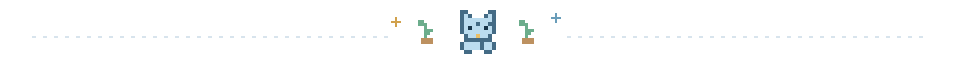</picture>

 

<h2><picture><source media="(prefers-color-scheme: dark) and (max-width: 600px)" srcset="assets/heading-about-v7-mobile-dark.svg"><source media="(prefers-color-scheme: dark)" srcset="assets/heading-about-v7-dark.svg"><source media="(max-width: 600px)" srcset="assets/heading-about-v7-mobile-light.svg"></picture></h2>

I’m **Raghav Sharma**, a student developer from **India** who enjoys building useful software and taking ideas into **international hackathons**.

I like connecting the whole experience: **a thoughtful interface → a working API → a clear workflow**. My recent team contributions include **branding, frontend development, integration, and document processing**.

I build with **TypeScript, React / Next.js, Python, and FastAPI**. I care about software that feels good to use—and looks like someone cared.

> [!NOTE]
> **Growing my toolkit:** local AI, document workflows, agent orchestration, and backend systems with clear policies.

 

<!-- RAGHAV_FACT_START -->

  <picture><source media="(prefers-color-scheme: dark) and (max-width: 600px)" srcset="assets/facts/fact-mobile-dark.svg?day=2026-10-05"><source media="(prefers-color-scheme: dark)" srcset="assets/facts/fact-dark.svg?day=2026-10-05"><source media="(max-width: 600px)" srcset="assets/facts/fact-mobile-light.svg?day=2026-10-05"></picture>

<!-- RAGHAV_FACT_END -->

A little about the daily grin

A shuffled collection of **32 lighthearted, fictional developer jokes**, starring Raghav. The [daily GitHub Action](.github/workflows/facts.yml) rotates the card around **08:49 IST**; its date shows which day’s joke is displayed. GitHub scheduling and image caching can delay updates.

[Read all the jokes](data/raghav-facts.json) · [Today’s joke](assets/facts/fact.json) · [How it rotates](scripts/update_fact.py)

 

<h2><picture><source media="(prefers-color-scheme: dark) and (max-width: 600px)" srcset="assets/heading-projects-v7-mobile-dark.svg"><source media="(prefers-color-scheme: dark)" srcset="assets/heading-projects-v7-dark.svg"><source media="(max-width: 600px)" srcset="assets/heading-projects-v7-mobile-light.svg"></picture></h2>

**Small ideas, real projects.** Pick a card to explore the repository; open its notes for the engineering and my contributions.

  <a href="https://github.com/kartikeyajay2006/Sovereign-On_Premise-Agentic-AI-Workbench"><picture><source media="(prefers-color-scheme: dark)" srcset="assets/project-aegis-v7-dark.svg"><source media="(prefers-color-scheme: light)" srcset="assets/project-aegis-v7-light.svg">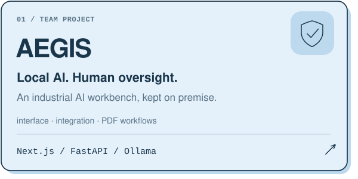</picture></a>
  &nbsp;&nbsp;
  <a href="https://github.com/raghav-shell/VisionX"><picture><source media="(prefers-color-scheme: dark)" srcset="assets/project-visionx-v7-dark.svg"><source media="(prefers-color-scheme: light)" srcset="assets/project-visionx-v7-light.svg">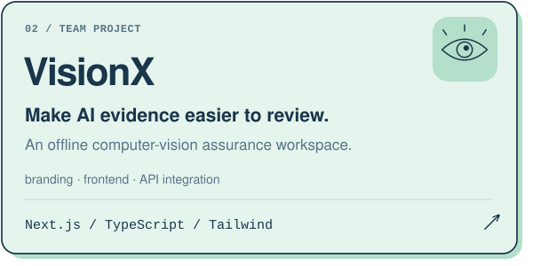</picture></a>

<b>Inside Aegis &amp; VisionX · team projects and my contributions</b>

**[AEGIS](https://github.com/kartikeyajay2006/Sovereign-On_Premise-Agentic-AI-Workbench)** brings local model inference, document retrieval, engineering calculations, verification, and human approvals into an industrial AI workbench. The repository implements Ollama inference and hybrid keyword/vector retrieval.

**My contribution:** Aegis branding and vector identity; the workbench, task dispatcher, and security interface; frontend/backend integration; and scanned-PDF extraction with page-specific evidence and macOS sandbox memory handling. [Inspect my extraction and sandbox changes →](https://github.com/kartikeyajay2006/Sovereign-On_Premise-Agentic-AI-Workbench/commit/74a8bf661e3cc75c571ed7b39576857f775e7129)

**[VisionX](https://github.com/raghav-shell/VisionX)** is an offline assurance workspace for reviewing datasets, models, inference provenance, and drift. **My contribution:** visual identity, frontend architecture, the assessment workspace, and frontend API integration. [Product tour →](https://github.com/raghav-shell/VisionX#product-tour) · [Team contributions →](https://github.com/raghav-shell/VisionX#contributors)

 

  <a href="https://github.com/raghav-shell/RazorFlow"><picture><source media="(prefers-color-scheme: dark)" srcset="assets/project-razorflow-v7-dark.svg"><source media="(prefers-color-scheme: light)" srcset="assets/project-razorflow-v7-light.svg">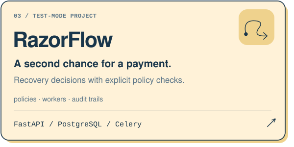</picture></a>
  &nbsp;&nbsp;
  <a href="https://github.com/raghav-shell/Compete_latest"><picture><source media="(prefers-color-scheme: dark)" srcset="assets/project-competeiq-v7-dark.svg"><source media="(prefers-color-scheme: light)" srcset="assets/project-competeiq-v7-light.svg">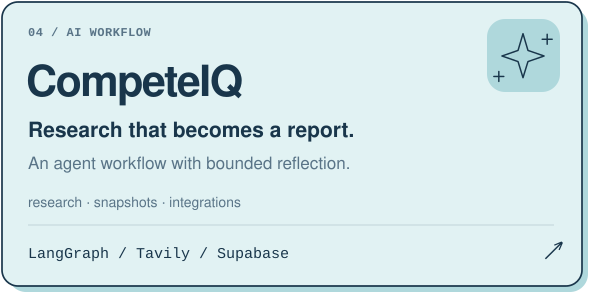</picture></a>

<b>Inside RazorFlow &amp; CompeteIQ · decisions, state, and background work</b>

**[RazorFlow](https://github.com/raghav-shell/RazorFlow)** explores failed-payment recovery in **Razorpay test mode**. AI suggests a strategy; deterministic policy decides what can execute. Signed webhook validation, deduplication, PostgreSQL persistence, Celery workers, and a hash-chained audit log connect the lifecycle. [Policy engine →](https://github.com/raghav-shell/RazorFlow/blob/master/backend/packages/domain/policy/engine.py) · [Concurrency tests →](https://github.com/raghav-shell/RazorFlow/blob/master/backend/tests/integration/test_execution_concurrency.py)

**[CompeteIQ](https://github.com/raghav-shell/Compete_latest)** gathers competitor research with Tavily, compares saved snapshots, analyzes signals, and prepares reports through LangGraph. Its evaluator allows one additional research pass, and the project includes scheduled runs, Supabase persistence, and Slack/Notion integrations. [Evaluator →](https://github.com/raghav-shell/Compete_latest/blob/main/competewise_backend/competeiq/pipeline/analyst_report.py) · [Live interface, sign-in required →](https://competeiq-three.vercel.app/)

 

  <a href="https://github.com/raghav-shell/Lexguard"><picture><source media="(prefers-color-scheme: dark)" srcset="assets/project-lexguard-v7-dark.svg"><source media="(prefers-color-scheme: light)" srcset="assets/project-lexguard-v7-light.svg">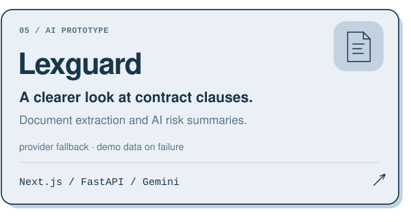</picture></a>
  &nbsp;&nbsp;
  <a href="https://github.com/raghav-shell/Os_Shell"><picture><source media="(prefers-color-scheme: dark)" srcset="assets/project-shell-v7-dark.svg"><source media="(prefers-color-scheme: light)" srcset="assets/project-shell-v7-light.svg">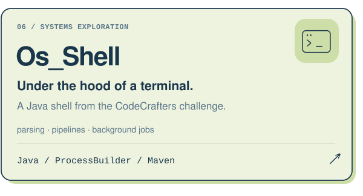</picture></a>

<b>Inside Lexguard &amp; Os_Shell · applied AI and systems fundamentals</b>

**[Lexguard](https://github.com/raghav-shell/Lexguard)** extracts PDF/DOCX text, chunks it, and presents structured contract-risk summaries. Its active analysis path uses a unified prompt with Gemini-to-OpenRouter fallback. **It is a prototype; failed analysis can return demo data.** [Screenshots →](https://github.com/raghav-shell/Lexguard/tree/main/screenshots) · [Analysis implementation →](https://github.com/raghav-shell/Lexguard/blob/main/lexguard_backend/services/unified_analysis.py)

**[Os_Shell](https://github.com/raghav-shell/Os_Shell)** is a Java shell built through the CodeCrafters challenge. It implements command parsing, PATH lookup, ProcessBuilder pipelines, output redirection, and background job tracking. [Read the implementation →](https://github.com/raghav-shell/Os_Shell/blob/master/src/main/java/Main.java)

<picture><source media="(prefers-color-scheme: dark)" srcset="assets/garden-v7-dark.svg"><source media="(prefers-color-scheme: light)" srcset="assets/garden-v7-light.svg"></picture>

 

<h2><picture><source media="(prefers-color-scheme: dark) and (max-width: 600px)" srcset="assets/heading-progress-v7-mobile-dark.svg"><source media="(prefers-color-scheme: dark)" srcset="assets/heading-progress-v7-dark.svg"><source media="(max-width: 600px)" srcset="assets/heading-progress-v7-mobile-light.svg"></picture></h2>

**A few fresh steps forward.** Recent public commits across my projects, refreshed daily.

  <a href="https://github.com/raghav-shell?tab=overview"><picture><source media="(prefers-color-scheme: dark) and (max-width: 600px)" srcset="assets/live/activity-mobile-dark.svg"><source media="(prefers-color-scheme: dark)" srcset="assets/live/activity-dark.svg"><source media="(max-width: 600px)" srcset="assets/live/activity-mobile.svg">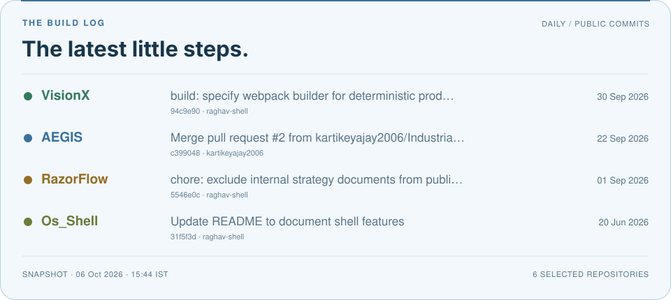</picture></a>

About the live build log

The card is generated from public GitHub commits attributed to `raghav-shell` on the default branches of six selected repositories. Its [GitHub Action](.github/workflows/profile.yml) refreshes it daily and on manual dispatch. A visible timestamp shows the snapshot’s age; if the API is unavailable, the previous snapshot is kept. GitHub scheduling and image caching can delay updates.

[Snapshot and commit links](assets/live/snapshot.json) · [Refresh implementation](scripts/update_profile.py)

 

<!-- FIREFLY_GARDEN_START -->

<h2><picture><source media="(prefers-color-scheme: dark) and (max-width: 600px)" srcset="assets/contributions/heading-mobile-dark.svg"><source media="(prefers-color-scheme: dark)" srcset="assets/contributions/heading-dark.svg"><source media="(max-width: 600px)" srcset="assets/contributions/heading-mobile-light.svg"></picture></h2>

  <picture><source media="(prefers-color-scheme: dark) and (max-width: 600px)" srcset="assets/contributions/garden-mobile-dark.svg?day=2026-10-06"><source media="(prefers-color-scheme: dark)" srcset="assets/contributions/garden-dark.svg?day=2026-10-06"><source media="(max-width: 600px)" srcset="assets/contributions/garden-mobile-light.svg?day=2026-10-06"></picture>

<!-- FIREFLY_GARDEN_END -->

About the animated contribution chart

**Contribution surf** brings a little adventure into the chart: a blue cat leans into hoverboard turns, its tiny scarf catches the breeze, and a fading rainbow trail follows the ride. Nearby tiles lift in a gentle ripple; active days briefly gain a colourful outline. The underlying contribution counts and intensity colours stay unchanged.

Desktop shows the rolling year; mobile shows the latest **13 calendar weeks** with its own count. The cat, trail and ripple are decorative, including movement through quiet weeks. Reduced motion displays a still, unobstructed chart.

The [daily garden Action](.github/workflows/garden.yml) refreshes the artwork around **08:53 IST**. The date range shows its age; a failed fetch keeps the last good garden. Motion pauses for visitors who prefer reduced motion.

[Explore the calendar](https://github.com/raghav-shell?tab=overview) · [Garden data](assets/contributions/snapshot.json) · [How it grows](scripts/update_garden.py)

 

<h2><picture><source media="(prefers-color-scheme: dark) and (max-width: 600px)" srcset="assets/heading-tools-v7-mobile-dark.svg"><source media="(prefers-color-scheme: dark)" srcset="assets/heading-tools-v7-dark.svg"><source media="(max-width: 600px)" srcset="assets/heading-tools-v7-mobile-light.svg"></picture></h2>

**For interfaces** · TypeScript, React, Next.js, Tailwind CSS, Vite

**For APIs & data** · Python, FastAPI, Pydantic, PostgreSQL, SQLAlchemy, SQLite, Redis, Celery

**For AI workflows** · LangGraph, Ollama integration, Gemini, OpenRouter, Tavily

**For building & checking** · Git, Docker Compose, pytest · Java for my shell project

 

<h2><picture><source media="(prefers-color-scheme: dark) and (max-width: 600px)" srcset="assets/heading-stack-v7-mobile-dark.svg"><source media="(prefers-color-scheme: dark)" srcset="assets/heading-stack-v7-dark.svg"><source media="(max-width: 600px)" srcset="assets/heading-stack-v7-mobile-light.svg"></picture></h2>

**The pieces behind the projects.** A mix of interface tools, backend systems, and AI building blocks.

**🖥️ Interfaces**

  <picture><source media="(prefers-color-scheme: dark)" srcset="assets/stack/typescript-dark.svg"><source media="(prefers-color-scheme: light)" srcset="assets/stack/typescript-light.svg">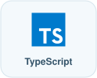</picture>
  &nbsp;
  <picture><source media="(prefers-color-scheme: dark)" srcset="assets/stack/react-dark.svg"><source media="(prefers-color-scheme: light)" srcset="assets/stack/react-light.svg">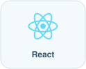</picture>
  &nbsp;
  <picture><source media="(prefers-color-scheme: dark)" srcset="assets/stack/nextjs-dark.svg"><source media="(prefers-color-scheme: light)" srcset="assets/stack/nextjs-light.svg">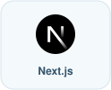</picture>
  &nbsp;
  <picture><source media="(prefers-color-scheme: dark)" srcset="assets/stack/tailwindcss-dark.svg"><source media="(prefers-color-scheme: light)" srcset="assets/stack/tailwindcss-light.svg">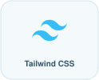</picture>
  &nbsp;
  <picture><source media="(prefers-color-scheme: dark)" srcset="assets/stack/vitejs-dark.svg"><source media="(prefers-color-scheme: light)" srcset="assets/stack/vitejs-light.svg">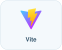</picture>

 

**🗃️ APIs & data**

  <picture><source media="(prefers-color-scheme: dark)" srcset="assets/stack/python-dark.svg"><source media="(prefers-color-scheme: light)" srcset="assets/stack/python-light.svg">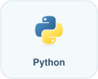</picture>
  &nbsp;
  <picture><source media="(prefers-color-scheme: dark)" srcset="assets/stack/fastapi-dark.svg"><source media="(prefers-color-scheme: light)" srcset="assets/stack/fastapi-light.svg">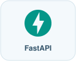</picture>
  &nbsp;
  <picture><source media="(prefers-color-scheme: dark)" srcset="assets/stack/pydantic-dark.svg"><source media="(prefers-color-scheme: light)" srcset="assets/stack/pydantic-light.svg">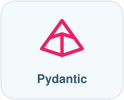</picture>
  &nbsp;
  <picture><source media="(prefers-color-scheme: dark)" srcset="assets/stack/postgresql-dark.svg"><source media="(prefers-color-scheme: light)" srcset="assets/stack/postgresql-light.svg"></picture>
  &nbsp;
  <picture><source media="(prefers-color-scheme: dark)" srcset="assets/stack/sqlalchemy-dark.svg"><source media="(prefers-color-scheme: light)" srcset="assets/stack/sqlalchemy-light.svg">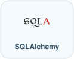</picture>
  &nbsp;
  <picture><source media="(prefers-color-scheme: dark)" srcset="assets/stack/sqlite-dark.svg"><source media="(prefers-color-scheme: light)" srcset="assets/stack/sqlite-light.svg"></picture>
  &nbsp;
  <picture><source media="(prefers-color-scheme: dark)" srcset="assets/stack/redis-dark.svg"><source media="(prefers-color-scheme: light)" srcset="assets/stack/redis-light.svg">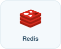</picture>
  &nbsp;
  <picture><source media="(prefers-color-scheme: dark)" srcset="assets/stack/celery-dark.svg"><source media="(prefers-color-scheme: light)" srcset="assets/stack/celery-light.svg">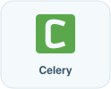</picture>

 

**✦ AI workflows**

  <picture><source media="(prefers-color-scheme: dark)" srcset="assets/stack/langgraph-dark.svg"><source media="(prefers-color-scheme: light)" srcset="assets/stack/langgraph-light.svg">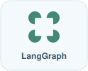</picture>
  &nbsp;
  <picture><source media="(prefers-color-scheme: dark)" srcset="assets/stack/ollama-dark.svg"><source media="(prefers-color-scheme: light)" srcset="assets/stack/ollama-light.svg">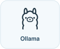</picture>
  &nbsp;
  <picture><source media="(prefers-color-scheme: dark)" srcset="assets/stack/googlegemini-dark.svg"><source media="(prefers-color-scheme: light)" srcset="assets/stack/googlegemini-light.svg">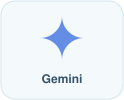</picture>
  &nbsp;
  <picture><source media="(prefers-color-scheme: dark)" srcset="assets/stack/openrouter-dark.svg"><source media="(prefers-color-scheme: light)" srcset="assets/stack/openrouter-light.svg"></picture>
  &nbsp;
  <picture><source media="(prefers-color-scheme: dark)" srcset="assets/stack/tavily-dark.svg"><source media="(prefers-color-scheme: light)" srcset="assets/stack/tavily-light.svg">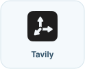</picture>

 

**🛠️ Build & check**

  <picture><source media="(prefers-color-scheme: dark)" srcset="assets/stack/git-dark.svg"><source media="(prefers-color-scheme: light)" srcset="assets/stack/git-light.svg">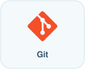</picture>
  &nbsp;
  <picture><source media="(prefers-color-scheme: dark)" srcset="assets/stack/docker-dark.svg"><source media="(prefers-color-scheme: light)" srcset="assets/stack/docker-light.svg">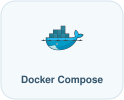</picture>
  &nbsp;
  <picture><source media="(prefers-color-scheme: dark)" srcset="assets/stack/pytest-dark.svg"><source media="(prefers-color-scheme: light)" srcset="assets/stack/pytest-light.svg">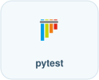</picture>
  &nbsp;
  <picture><source media="(prefers-color-scheme: dark)" srcset="assets/stack/java-dark.svg"><source media="(prefers-color-scheme: light)" srcset="assets/stack/java-light.svg">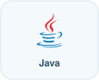</picture>

 

<picture><source media="(prefers-color-scheme: dark)" srcset="assets/garden-v7-dark.svg"><source media="(prefers-color-scheme: light)" srcset="assets/garden-v7-light.svg"></picture>

  <a href="https://raghav-shell.github.io/raghav-shell/game/"><picture><source media="(prefers-color-scheme: dark) and (max-width: 600px)" srcset="assets/game-card-mobile-dark.svg"><source media="(prefers-color-scheme: dark)" srcset="assets/game-card-dark.svg"><source media="(max-width: 600px)" srcset="assets/game-card-mobile-light.svg">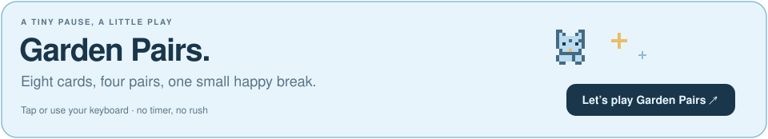</picture></a>

<a href="https://raghav-shell.github.io/raghav-shell/game/"><b>Play a little Garden Pairs ↗</b></a> · Eight cards. Four pairs. No rush.

 

  <a href="https://www.linkedin.com/in/raghav-sharma-in/"><picture><source media="(prefers-color-scheme: dark)" srcset="assets/connect-v7-dark.svg"><source media="(prefers-color-scheme: light)" srcset="assets/connect-v7-light.svg">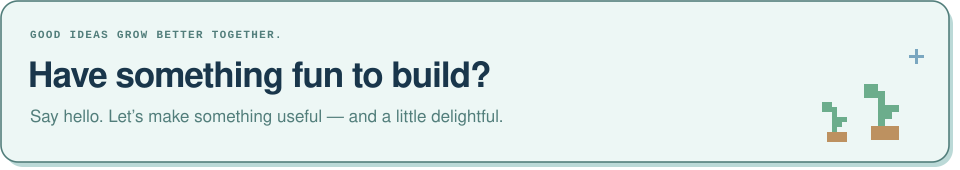</picture></a>

  <a href="https://www.linkedin.com/in/raghav-sharma-in/"><b>Say hello on LinkedIn ↗</b></a> &nbsp; · &nbsp;
  <a href="https://github.com/raghav-shell?tab=repositories">Explore more projects ↗</a>

 

  <picture><source media="(prefers-color-scheme: dark) and (max-width: 600px)" srcset="assets/garden-base-mobile-dark.svg"><source media="(prefers-color-scheme: dark)" srcset="assets/garden-base-dark.svg"><source media="(max-width: 600px)" srcset="assets/garden-base-mobile-light.svg"></picture>

